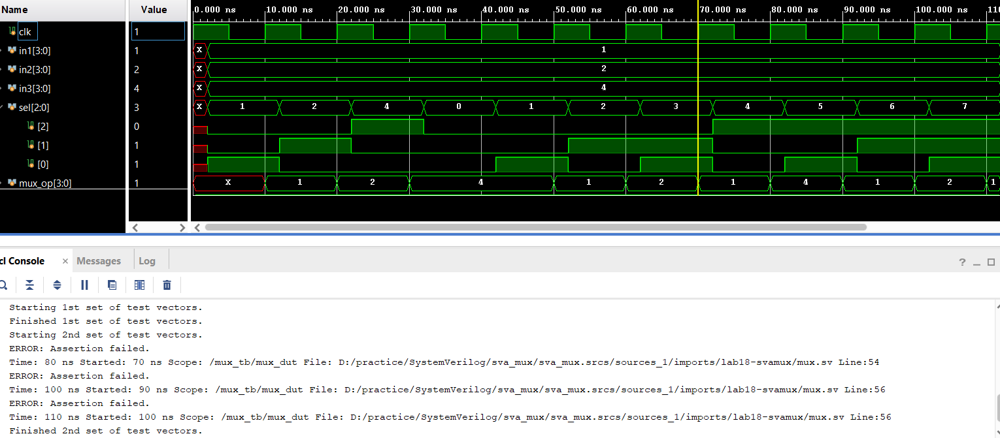

# Mux

SystemVerilog Assertion Concept

Block Diagram
                
                |------------------------------------|
                |  |--\                              |
                |  |   \                             |
                |  |    \                            |
    in1----/4-->|--|     \                           |
                |  |      |         |-------------|  |
    in2----/4-->|--|      |----/4-->|             |  |
                |  |      |         |             |--|----/4--> mux_op
    in3----/4-->|--|     /          |             |  |
                |  |    / |         |             |  |
                |  |   /  |         |             |  |
                |  |--/|  |         |             |  |
    clk-------->|---|--|--|---------|>            |  |
                |   |  |  |         |-------------|  |
                |   |  |  |                          |
                |---|--|--|--------------------------|
                    |  |  | 
    sel1----------->|  |  |
    sel2-------------->|  |
    sel3----------------->|
    
Specification
- `in1`, `in2`, `in3` and `mux_op` are 4-bit vectors
- Inputs are sampled on the rising edge of `clk`
- If `sel1` is logic 1, input `in1` is assigned to `mux_op`
- Otherwise if `sel2` is logic 1, input `in2` is assigned to `mux_op`
- Otherwise if `sel3` is logic 1, input `in3` is assigned to `mux_op`

Assertion
  - Assert 3 properties, evaluated only on the rising edge of `clk` to do the following
    - When `sel1` is logic 1, check that in the next evaluation cycle `mux_op` equals `in1` from the past cycle
    - When `sel2` is logic 1, check that in the next evaluation cycle `mux_op` equals `in2` from the past cycle
    - When `sel3` is logic 1, check that in the next evaluation cycle `mux_op` equals `in3` from the past cycle
  
Assertion Result

